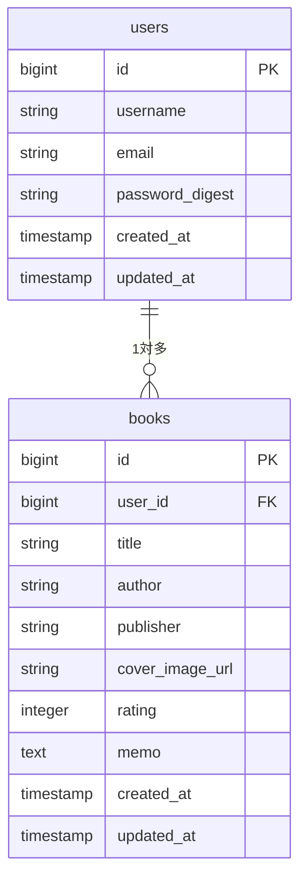

# 読書管理アプリケーション

個人の読書記録を管理するWebアプリケーションです。書籍の検索・登録・評価・メモ機能を提供し、読書体験を豊かにサポートします。

## 環境構築

### 前提条件
- Ruby 3.4.4
- PostgreSQL
- Node.js (importmap使用)

### セットアップ手順

1. **リポジトリのクローン**
```bash
git clone <repository-url>
cd reading_management
```

2. **依存関係のインストール**
```bash
bundle install
```

3. **データベースの設定**
```bash
# PostgreSQLの起動
# macOS (Homebrew)
brew services start postgresql

# データベースの作成・マイグレーション
bin/rails db:create
bin/rails db:migrate
```

4. **Google Books API キーの設定**
```bash
# 認証情報の編集
bin/rails credentials:edit

# 以下を追加
google_books_api_key: YOUR_API_KEY_HERE
```

5. **アプリケーションの起動**
```bash
# 開発サーバーの起動
bin/rails server

# または開発用の統合起動
bin/dev
```

6. **ブラウザでアクセス**
```
http://localhost:3000
```

## 使用技術（実行環境）

### バックエンド
- **Ruby** 3.4.4
- **Ruby on Rails** 8.0.2
- **PostgreSQL** (データベース)

### フロントエンド
- **HTML/CSS/JavaScript**
- **Turbo Rails** (SPA風のページ遷移)
- **Stimulus** (JavaScriptフレームワーク)
- **Importmap** (モジュール管理)

### 外部API
- **Google Books API** (書籍検索)

### インフラ・デプロイ
- **Docker** (コンテナ化)
- **Kamal** (デプロイツール)
- **Thruster** (アセット配信・圧縮)

### 開発・テストツール
- **Brakeman** (セキュリティ解析)
- **RuboCop** (コードスタイル)
- **Capybara + Selenium** (システムテスト)

## ER図



## URL

| 機能 | URL | HTTPメソッド | 認証 |
|------|-----|-------------|------|
| ルートページ（書籍一覧） | `/` | GET | 必要 |
| 新規登録画面 | `/signup` | GET | 不要 |
| 新規登録処理 | `/signup` | POST | 不要 |
| ログイン画面 | `/login` | GET | 不要 |
| ログイン処理 | `/login` | POST | 不要 |
| ログアウト処理 | `/logout` | DELETE | 必要 |
| 書籍一覧 | `/books` | GET | 必要 |
| 書籍詳細 | `/books/:id` | GET | 必要 |
| 書籍新規登録画面 | `/books/new` | GET | 必要 |
| 書籍新規登録処理 | `/books` | POST | 必要 |
| 書籍編集画面 | `/books/:id/edit` | GET | 必要 |
| 書籍更新処理 | `/books/:id` | PATCH | 必要 |
| 書籍削除処理 | `/books/:id` | DELETE | 必要 |
| 外部書籍検索API | `/books/search_external` | GET | 必要 |
| ヘルスチェック | `/up` | GET | 不要 |

## 機能一覧

### 認証機能
- **ユーザー新規登録**: ユーザー名・メールアドレス・パスワードでアカウント作成
- **ログイン/ログアウト**: セッション管理による認証
- **認証チェック**: 未ログイン時の自動リダイレクト

### 書籍管理機能
- **書籍一覧表示**: 登録済み書籍をカード形式で表示
- **書籍詳細表示**: 書籍の詳細情報・評価・メモの確認
- **書籍新規登録**: 手動入力または外部API検索からの登録
- **書籍編集**: 登録済み書籍情報の更新
- **書籍削除**: 不要な書籍の削除
- **書籍検索**: タイトルによる絞り込み検索

### 外部API連携
- **Google Books API検索**: 書籍タイトル・著者での検索
- **書籍情報自動取得**: タイトル・著者・出版社・表紙画像の自動入力
- **ページング機能**: 検索結果の分割表示

### 評価・メモ機能
- **5段階評価**: ★1〜★5での書籍評価
- **読書メモ**: 感想や印象に残った部分の記録
- **統計表示**: 読了冊数・平均評価・今月の読了数

### UI/UX機能
- **レスポンシブデザイン**: モバイル・タブレット対応
- **リアルタイム検索**: JavaScript非同期通信
- **アニメーション効果**: ページ遷移・ホバー効果
- **温かみのあるデザイン**: 木目調カラーテーマ

## テーブル仕様

### users table
| カラム名 | データ型 | 制約 | 説明 |
|---------|---------|------|------|
| id | bigint | PRIMARY KEY, AUTO_INCREMENT | ユーザーID |
| username | string | NOT NULL, UNIQUE, 3-20文字 | ユーザー名 |
| email | string | NOT NULL, UNIQUE, メール形式 | メールアドレス |
| password_digest | string | NOT NULL | ハッシュ化パスワード |
| created_at | timestamp | NOT NULL | 作成日時 |
| updated_at | timestamp | NOT NULL | 更新日時 |

**インデックス:**
- `index_users_on_username` (UNIQUE)
- `index_users_on_email` (UNIQUE)

### books table
| カラム名 | データ型 | 制約 | 説明 |
|---------|---------|------|------|
| id | bigint | PRIMARY KEY, AUTO_INCREMENT | 書籍ID |
| user_id | bigint | NOT NULL, FOREIGN KEY | ユーザーID（外部キー） |
| title | string | NOT NULL, 最大255文字 | 書籍タイトル |
| author | string | 最大255文字 | 著者名 |
| publisher | string | 最大255文字 | 出版社名 |
| cover_image_url | string | URL形式 | 表紙画像URL |
| rating | integer | 1-5の範囲, NULL許可 | 5段階評価 |
| memo | text | 最大1000文字 | 読書メモ・感想 |
| created_at | timestamp | NOT NULL | 作成日時 |
| updated_at | timestamp | NOT NULL | 更新日時 |

**インデックス:**
- `index_books_on_user_id`
- `index_books_on_user_id_and_title` (複合インデックス)

**外部キー制約:**
- `user_id` → `users.id` (CASCADE DELETE)

## 開発・テスト

### コード品質チェック
```bash
# セキュリティチェック
bin/brakeman

# コードスタイルチェック
bin/rubocop

# JavaScriptセキュリティチェック
bin/importmap audit
```

### テスト実行
```bash
# 全テスト実行
bin/rails test

# システムテスト実行
bin/rails test:system
```

### Google Books API設定確認
```bash
# API設定チェック
bin/rails google_books:check_config

# API接続テスト
bin/rails google_books:test_api
```

## デプロイ

### Docker環境
```bash
# Dockerイメージビルド
docker build -t reading_management .

# コンテナ起動
docker run -d -p 80:80 -e RAILS_MASTER_KEY=<value> reading_management
```

### Kamalデプロイ
```bash
# 初回デプロイ
bin/kamal deploy

# 更新デプロイ
bin/kamal redeploy
```

## ライセンス

MIT License